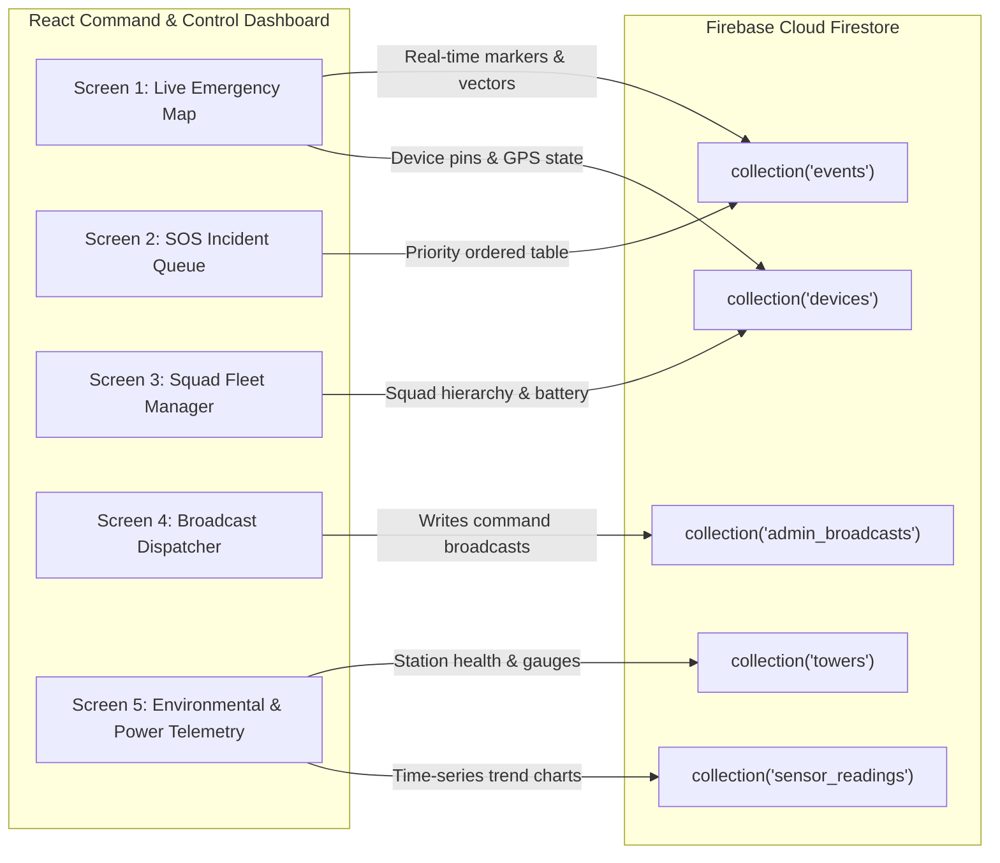

# QuickRescue — Firebase Cloud Data Structure & Schema Reference
# Revision 1.0 | Firestore Collections, Documents & Dashboard Mapping

---

## 1. Overview & Cloud Synchronization Architecture

The QuickRescue Communication Tower connects to Google Firebase Cloud Firestore via the `cloud_sync.py` background service.
- **Offline Resilient:** Incidents and sensor readings created while offline in SQLite (`tower.db`) are automatically pushed when network connectivity is restored.
- **Idempotent Upserts:** All documents utilize deterministic IDs (`event_{id}`, `dev_{id}`, `tower_{id}`) with `set(..., merge=True)`, guaranteeing **zero duplicate records** during retries or partial network dropouts.
- **Bi-Directional:** Pushes field incidents and tower telemetry to the cloud; pulls emergency Admin Broadcasts from the cloud and transmits them over LoRa to all field Handy Devices.

---

## 2. Firestore Collections & Document Specifications

### 2.1 Collection: `events`
*Powers Dashboard Screen 1: Live Emergency Map & Screen 2: SOS Incident Queue*

Deterministic Document ID: `event_{id}` (e.g. `event_101`)

| Field Name | Type | Description | Example |
|---|---|---|---|
| `id` | `number` | Tower local event integer ID | `101` |
| `tower_id` | `number` | ID of the receiving gateway tower | `1` |
| `device_id` | `number` | Source Handy Device ID | `66` (`0x0042`) |
| `type` | `string` | Event classification: `SOS`, `HELP`, `SAFE`, `HEARTBEAT`, `BROADCAST` | `"SOS"` |
| `priority` | `number` | Priority rank (1=SOS, 2=HELP, 3=BROADCAST, 4=SAFE, 5=HEARTBEAT) | `1` |
| `status` | `string` | Incident lifecycle state: `NEW`, `ACKNOWLEDGED`, `IN PROGRESS`, `RESOLVED` | `"NEW"` |
| `lat` | `number` | Latitude in decimal degrees | `28.614000` |
| `lon` | `number` | Longitude in decimal degrees | `77.209000` |
| `location_state` | `string` | GPS fix condition: `VALID`, `LAST_KNOWN`, `UNAVAILABLE` | `"VALID"` |
| `rssi` | `number` | Signal strength in dBm at reception | `-78` |
| `battery` | `number` | Battery percentage of sending device (0–100) | `85` |
| `event_time` | `number` | Device timestamp (Unix epoch seconds) | `1727583069` |
| `synced_at` | `number` | Timestamp when uploaded to Firebase | `1727583120` |
| `details` | `map` | Contextual packet metadata (hop count, motion, alert codes) | `{"motion": "MOVING", "hop_count": 0}` |

---

### 2.2 Collection: `devices`
*Powers Dashboard Screen 1: Live Emergency Map & Screen 3: Squad Fleet Manager*

Deterministic Document ID: `dev_{device_id}` (e.g. `dev_66`)

| Field Name | Type | Description | Example |
|---|---|---|---|
| `device_id` | `number` | 16-bit Hardware ID | `66` (`0x0042`) |
| `name` | `string` | Friendly designation / responder name | `"Squad Leader Alpha"` |
| `is_master_jacket`| `boolean` | Squad leader node with mesh priority | `true` |
| `is_active` | `boolean` | Dynamically true if heartbeat within 180s | `true` |
| `is_sos_active` | `boolean` | True if unresolved SOS emergency is open | `false` |
| `last_msg_type` | `string` | Last packet received from device | `"HEARTBEAT"` |
| `last_seq` | `number` | Last sequence number transmitted | `45` |
| `lat` | `number` | Latest recorded latitude | `28.614000` |
| `lon` | `number` | Latest recorded longitude | `77.209000` |
| `gps_status` | `string` | `VALID`, `LAST_KNOWN`, or `UNAVAILABLE` | `"VALID"` |
| `battery` | `number` | Current battery percentage | `70` |
| `motion` | `number` | `0`=Static, `1`=Moving, `2`=Fall Detected | `1` |
| `last_rssi` | `number` | Last signal strength (dBm) | `-80` |
| `hop_count` | `number` | Number of mesh hops required to reach tower | `1` |
| `last_seen_epoch`| `number` | Epoch seconds of last contact | `1727583200` |
| `updated_at` | `number` | Server sync timestamp | `1727583205` |

---

### 2.3 Collection: `towers`
*Powers Dashboard Screen 5: Tower & Environmental Telemetry*

Deterministic Document ID: `tower_{tower_id}` (e.g. `tower_1`)

| Field Name | Type | Description | Example |
|---|---|---|---|
| `tower_id` | `number` | Unique tower station identifier | `1` |
| `name` | `string` | Station name and sector | `"Sector 4 Central Gateway"` |
| `lat` | `number` | Fixed physical latitude of tower | `28.613900` |
| `lon` | `number` | Fixed physical longitude of tower | `77.209000` |
| `status` | `string` | Connectivity status: `ONLINE`, `OFFLINE` | `"ONLINE"` |
| `last_seen` | `number` | Epoch seconds of last heartbeat | `1727583300` |
| `active_devices_count`| `number` | Count of field devices currently active | `14` |
| `active_sos_count` | `number` | Count of active unresolved SOS incidents | `0` |
| `power` | `map` | Battery voltage, net current, solar charging status | `{"battery_voltage": 13.2, "status": "CHARGING"}` |
| `environment` | `map` | Ambient temperature, rain moisture, flood level | `{"water_level_mm": 450, "temperature_c": 28.5}` |

---

### 2.4 Collection: `admin_broadcasts`
*Powers Dashboard Screen 4: Command Broadcast & Warning Center*

Auto-generated or custom Document ID (e.g. `bcast_1727583400`)

| Field Name | Type | Description | Example |
|---|---|---|---|
| `alert_title` | `string` | Headline text (max 64 chars) | `"CIVIL EVACUATION ORDER"` |
| `alert_level` | `number` | `1`=Info, `2`=Warning, `3`=Critical | `3` |
| `alert_code` | `number` | Protocol code: `0x0001` (Evac), `0x0002` (Flood), etc. | `1` |
| `message` | `string` | Short message text for P10 & Handy OLED | `"Dam breach in Sector 3. Evacuate."` |
| `target_tower_id`| `number`| `0` = All towers; or specific tower ID | `0` |
| `created_by` | `string` | Incident commander name or ID | `"NDRF_COMMANDER_01"` |
| `created_at` | `number` | Epoch timestamp of creation | `1727583400` |
| `dispatched_to_lora`| `boolean`| Set to `true` by tower once transmitted over radio | `true` |
| `dispatched_at`| `number` | Epoch timestamp of radio transmission | `1727583405` |
| `dispatched_by_tower`| `number`| Tower ID that transmitted the LoRa packet | `1` |

---

### 2.5 Collection: `sensor_readings`
*Time-series environmental and power history for charts and trend analysis*

Deterministic Document ID: `sensor_{id}` (e.g. `sensor_4501`)

| Field Name | Type | Description | Example |
|---|---|---|---|
| `id` | `number` | Local SQLite reading ID | `4501` |
| `tower_id` | `number` | Source tower station ID | `1` |
| `sensor_type`| `string` | `WATER_LEVEL_MM`, `RAIN_LEVEL`, `BATTERY_VOLTAGE` | `"WATER_LEVEL_MM"` |
| `value` | `number` | Float measured value | `1250.0` |
| `unit` | `string` | Measurement unit (`mm`, `V`, `A`, `C`) | `"mm"` |
| `status` | `string` | Threshold condition: `NORMAL`, `WARNING`, `CRITICAL`| `"WARNING"` |
| `recorded_epoch`| `number` | Measurement time | `1727583500` |

---

## 3. Dashboard Screen to Firebase Collection Mapping

