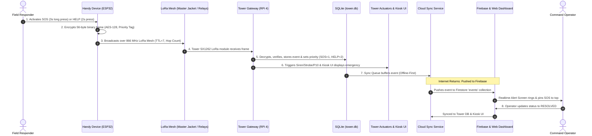

# QuickRescue — End-to-End Integration Checklist & Verification Plan
**Version:** 1.0  
**Target Environment:** Raspberry Pi 4 Gateway Tower, ESP32 Handy Devices, React Command Center  
**Protocol Spec:** 56-Byte Binary LoRa Frame with AES-128 Encryption & Priority Ingestion  

---

## 1. Flow to Verify (From Technical Document)



---

## 2. Step-by-Step Manual Test Checklist

| Step # | System Component | Action / Procedure | Expected Result | Pass / Fail Criteria |
|---|---|---|---|---|
| **1.0** | **Handy Device Input** | Responder presses the **SOS button** (red) and holds for 3 continuous seconds (or **HELP button** (yellow) for 2 seconds). | - Red tactile LED starts flashing.<br>- Hardware piezo buzzer sounds distinct pulsating alert.<br>- OLED screen displays: `Tx: SOS! RSSI:---`. | **PASS:** Guarded 3s timer elapses before trigger; quick taps (<3s) on SOS do not trigger accidental alert. |
| **2.0** | **Binary Frame Creation** | Firmware packs telemetry into a 56-byte struct: version `0x01`, msg_type `0x03` (SOS), device ID, sequence number, GPS coordinates, battery, and motion state. Frame encrypted using AES-128 ECB + CMAC/MIC. | - Packet size is exactly 56 bytes.<br>- Encryption payload is opaque on air.<br>- If GPS locked, `GPS_VALID (0x01)`; if indoor/rubble, sets `GPS_UNAVAILABLE (0x00)` with last RSSI. | **PASS:** Exact 56-byte wire buffer; zero buffer overflows. Valid AES-128 ciphertext produced. |
| **3.0** | **Mesh Relay Propagation** | Device transmits at +22 dBm (866 MHz). Intermediate nodes (Field Node / Master Jacket) receive frame. If destination is not local, decrement TTL and increment hop count. | - Packet travels direct (0 hops) or through relay (hop count $\ge 1$, TTL $\le 6$).<br>- Intermediate nodes suppress duplicate frames via sequence cache. | **PASS:** Packet reaches tower within $<2.5\text{s}$ over up to 3 hops without packet loss. |
| **4.0** | **Tower LoRa Reception** | Tower SX1262 radio receives 56-byte wire buffer. Passes to `receiver.py` background service via SPI interface. | - `receiver.py` logs:<br>`[RECV] MSG_SOS from 0x0042 \| Seq=... Hop=... RSSI=-78dBm`<br>- Sends immediate AES-128 `MSG_ACK (0x06)` back to device.<br>- OLED on Handy Device updates: `ACK: OK (Tower 01)`. | **PASS:** Decryption succeeds; CRC & packet length verified; immediate ACK transmitted over LoRa. |
| **5.0** | **Priority Ingestion & SQLite Storage** | Tower verifies packet uniqueness (anti-replay check). Inserts record into `events` table in `tower.db` with strict priority assignment. Adds entry to `sync_queue`. | - SQLite `events` record created:<br>`type='SOS', priority=1, status='NEW', synced=0`.<br>- For HELP: `priority=2`.<br>- SQLite `sync_queue` record created with status `'PENDING'`. | **PASS:** Record present in `tower.db` with priority=1 (SOS) or priority=2 (HELP); device table updated. |
| **6.0** | **Tower Outputs & Kiosk UI** | `alert_manager.py` triggers physical actuators; local touchscreen UI pulls from REST API (`/api/events`). | - **Physical Actuators:** Siren pulses at 100dB; High-power RED strobe turns on; P10 Matrix scrolls: `SOS! DEV: 0x0042 LAT:...`.<br>- **Touchscreen Kiosk:** SOS banner flashes at top of 7" display with 1-click ACK / RESOLVE button.<br>- **Voice Assistant:** Spoken TTS announcement through tower speaker. | **PASS:** Outputs trigger within $<500\text{ms}$ of packet reception even when completely disconnected from the internet. |
| **7.0** | **Cloud Synchronization** | **Scenario A (Internet OFF):** `cloud_sync.py` detects network down, retains records in SQLite `sync_queue`.<br>**Scenario B (Internet ON):** Internet restores; `cloud_sync.py` pushes unsynced records to Firestore `events` collection. | - **Offline:** Zero dropped records; `synced=0`.<br>- **Online Reconnect:** All unsynced records uploaded in priority order.<br>- Deterministic IDs (`event_{id}`) ensure zero duplicates.<br>- React Dashboard plays siren chime, pins SOS to top of table. | **PASS:** SOS appears on Dashboard within $<2\text{s}$ of internet restoration; no duplicate documents created. |
| **8.0** | **Operator Lifecycle Resolution** | Command Center operator reviews incident, dispatches rescue squad, and clicks **"RESOLVE"** on Dashboard or Kiosk. | - Dashboard issues status update: `status: "RESOLVED"`.<br>- Firestore document updates.<br>- Local tower marks `events.status = 'RESOLVED'`.<br>- Siren silences; strobe light switches to solid green. | **PASS:** Status changes from `NEW` $\to$ `ACKNOWLEDGED` $\to$ `IN PROGRESS` $\to$ `RESOLVED`; tower actuators stand down. |

---

## 3. Comprehensive Troubleshooting Matrix

| Step # | Failure Symptom | Most Likely Root Cause | Diagnostic Method | Remediation Action |
|---|---|---|---|---|
| **Step 1** | Handy Device does not trigger SOS after pressing button. | 1. Button pressed for $<3\text{s}$ (false trigger guard).<br>2. Mechanical button contact bounce.<br>3. Device battery $<3.0\text{V}$ (low-voltage shutdown). | Check serial monitor at 115200 baud:<br>`[BTN] Hold duration: 1800ms (threshold: 3000ms)` | - Instruct responder to hold button until red LED flashes and buzzer sounds.<br>- Check battery voltage on OLED (`B:XX%`). Recharge if $<3.3\text{V}$. |
| **Step 2** | Handy Device crashes or transmits garbage payload. | 1. AES-128 key mismatch with tower (`PSK_DEV`).<br>2. GPS module cold-start timeout blocking main loop.<br>3. Stack overflow in encryption buffer. | Inspect serial log for stack trace or unhandled exception during `encode()`. | - Ensure `config.h` defines correct 16-byte `PSK_DEV`.<br>- Verify non-blocking TinyGPS++ parser with `GPS_UNAVAILABLE` fallback after 1000ms. |
| **Step 3** | Packet transmitted by node but not relayed by intermediate mesh nodes. | 1. Mesh TTL decremented to 0.<br>2. Relay node in low-power deep sleep.<br>3. CAD channel collision / channel saturation. | Check relay node serial output:<br>`[MESH] Dropping packet: TTL=0` or `[MESH] Duplicate seq #`. | - Ensure initial node sets TTL=7.<br>- Verify Master Jacket has LoRa RX continuously listening (not deep sleeping).<br>- Adjust CAD backoff random jitter (50–200ms). |
| **Step 4** | Tower LoRa receiver never logs incoming packet. | 1. Frequency mismatch (865 vs 866.5 vs 868 MHz).<br>2. Spreading factor / bandwidth mismatch (SF7 vs SF10).<br>3. LoRa HAT SPI connection loose on Raspberry Pi.<br>4. Missing antenna resulting in RF front-end deafening. | Run `dmesg \| grep spi` and check `receiver.log`:<br>`journalctl -u quickrescue-receiver -f` | - Verify `lora_driver.py` configuration (Freq: 866.0 MHz, SF: 7, BW: 125 kHz, CR: 4/5).<br>- Check SPI connections on Pi GPIO pins (MOSI: 10, MISO: 9, SCK: 11, NSS: 8, DIO0: 25).<br>- Attach calibrated 868MHz whip/collinear antenna. |
| **Step 5** | Packet received but not stored; or priority inverted. | 1. SQLite database locked (`sqlite3.OperationalError: database is locked`).<br>2. Missing table or index migration.<br>3. Anti-replay duplicate filter dropping valid retries. | Run `sqlite3 tower.db "PRAGMA integrity_check;"`<br>Inspect `receiver.log` for `[STORAGE] Error: ...` | - Set SQLite connection timeout to `15.0s` and enable WAL mode (`PRAGMA journal_mode=WAL;`).<br>- Verify `PRIORITY_MAP` in `storage.py` maps `SOS -> 1`, `HELP -> 2`. |
| **Step 6** | Touchscreen Kiosk does not show alert or siren does not sound. | 1. GPIO permission error for pigpio/RPi.GPIO.<br>2. FastAPI backend (`quickrescue-api.service`) not running on port 8000.<br>3. Kiosk Chromium browser disconnected from API. | Check API status:<br>`curl http://localhost:8000/api/health`<br>Check service: `systemctl status quickrescue-api` | - Add tower user to `gpio` and `dialout` groups (`sudo usermod -aG gpio,dialout pi`).<br>- Restart API service: `sudo systemctl restart quickrescue-api`.<br>- Verify Kiosk poller or WebSocket connection in browser devtools. |
| **Step 7** | Alert visible on tower touchscreen but not appearing on Cloud Dashboard. | 1. Tower offline (cellular/WAN cable disconnected).<br>2. `serviceAccountKey.json` missing or invalid permissions.<br>3. `cloud_sync.py` hung or crashed.<br>4. Clock drift between Tower and Firebase servers. | Check sync service log:<br>`journalctl -u quickrescue-sync -f`<br>Run `timedatectl` to verify NTP sync. | - When offline, this is expected behavior: verify records buffered in `sync_queue`.<br>- Verify `serviceAccountKey.json` exists in `tower/` and has Firestore write rules.<br>- Run `sudo chronyd -q 'server pool.ntp.org iburst'` to sync system clock. |
| **Step 8** | Operator clicks "RESOLVE" on Dashboard but status reverts or tower siren continues. | 1. Firestore security rules prevent non-admin updates.<br>2. Tower sync service offline, cannot pull status update.<br>3. Siren hardware auto-timeout failure. | Check browser console network tab for `403 FORBIDDEN` on Firestore write.<br>Check `/api/alerts/silence` endpoint on Tower API. | - Ensure Firestore rules allow authenticated operators to update `status` in `/events/{id}`.<br>- Use Kiosk touchscreen local "ACK / SILENCE" button to kill siren locally offline.<br>- Check `siren_auto_off_sec` watchdog in `actuators.py`. |

---

## 4. Verification Test Matrix Summary

```
===================================================================================
QuickRescue Verification Criteria
===================================================================================
Local Only Mode (Internet Disconnected):
  [✓] SOS/HELP packet received via LoRa radio / simulator
  [✓] Decrypted using AES-128 and validated against 56-byte protocol specification
  [✓] Priority properly assigned: SOS=1, HELP=2
  [✓] Event stored in SQLite 'events' table
  [✓] Physical actuators triggered (Siren/Strobe/P10)
  [✓] Local Touchscreen API (/api/events) returns new incident
  [✓] Event buffered in 'sync_queue' with status 'PENDING'
  [✓] Operator updates status to RESOLVED via local Kiosk API
  [✓] Actuators stood down and silenced

Cloud Sync Mode (Internet Connected):
  [✓] Network connectivity detected by sync service
  [✓] Unsynced offline events pushed to Firebase in priority order
  [✓] Deterministic doc IDs ('event_{id}') prevent duplicate document creation
  [✓] Dashboard ingests event in real-time without page refresh
  [✓] Cloud status update to RESOLVED propagates to Tower
===================================================================================
```
